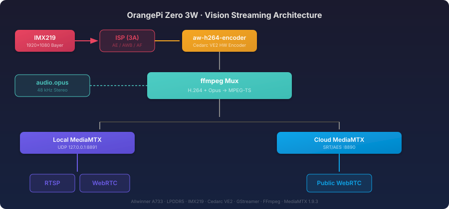
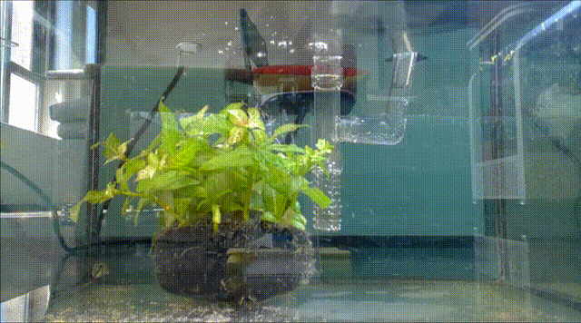

# OrangePi Vision

<p align="center">
  
</p>

<p align="center">
  <strong>An edge-vision service for OrangePi ZERO 3W and IMX219.</strong><br>
  Hardware encoding · Local WebRTC · Encrypted SRT · Optional AI detection
</p>

<p align="center">
  <a href="https://github.com/ma-shiqi/opi-vision"></a>
  <a href="#access"></a>
  <a href="LICENSE"></a>
</p>

<p align="center">
  <a href="#quick-start">Quick start</a> · <a href="#architecture">Architecture</a> · <a href="#access">Access</a> · <a href="#changelog">Changelog</a> · <a href="README.zh-CN.md">中文</a>
</p>

## Architecture

<p align="center">
  
</p>

Camera mode is the default. YOLO mode optionally inserts YOLO26s and ByteTrack before encoding. Audio is `config/audio.opus` (48 kHz stereo); board-side HLS is disabled.

## Quick start

```bash
cd ~/orangepi-vision
chmod +x vision vision-withyolo bin/* src/src-camera/build-board-tools.sh
./src/src-camera/build-board-tools.sh  # first deployment only
./vision --start
```

```bash
./vision
./vision --start --size 1280x720 --fps 20
./vision --start --audio off
./vision --status
./vision --log
./vision --stop
```

<p align="center"></p>

<p align="center"><em>Live camera view through the WebRTC player.</em></p>

Stop the service before changing mode, resolution, frame rate, encoder, or rotation.

## Access

| Protocol | Endpoint | Use |
|---|---|---|
| WebRTC | `http://<board-ip>:8889/vision` | Low-latency LAN preview |
| RTSP | `rtsp://<board-ip>:8554/vision` | VLC, NVR, and RTSP clients |
| Public WebRTC | `https://<your-domain>/vision/` | Cloud deployment |

## Configuration

```bash
cp config/vision.env.example config/vision.env
```

Set the five `VISION_SRT_*` values together to enable cloud forwarding. Leave all five blank to use local streaming only. Never commit `config/vision.env`.

Cloud deployment templates are [`config/mediamtx.yml.ToBeUploadToOnlineServer.example`](config/mediamtx.yml.ToBeUploadToOnlineServer.example) and [`config/nginx.conf.ToBeUploadToOnlineServer.example`](config/nginx.conf.ToBeUploadToOnlineServer.example). Copy each to the corresponding real deployment filename, replace placeholders, and keep the resulting real configuration private.

## Changelog

### V2 — WebRTC local and cloud deployment

- H.264 + Opus is published once, then served locally through MediaMTX.
- Encrypted SRT forwards the stream to cloud MediaMTX for public WebRTC playback.
- Nginx serves `/vision/` and proxies WHEP; viewer authentication is disabled by default.
- FRP and board-side HLS are retained only as a disabled legacy fallback.

### V1 — HLS deployment

- Board-side HLS was exposed through FRP, Nginx, and HTTPS.
- This path is superseded by V2 WebRTC and is documented only as a legacy fallback.

## Documentation

- [部署与运维指南](docs/部署与运维指南.md) — 板端配置、云端部署、日常运维
- [V1 FRP + HLS 旧方案（已归档）](docs/V1_FRP_HLS_部署方案.md)
- [YOLO26 cross-compilation and board deployment](src/src-yolo26/README.md)
- [Cedarc runtime and hardware encoding](src/src-cedarc/vendor/CEDARC_HARDWARE_ENCODING.md)

## Release safety

Do not commit real cloud configuration, `config/vision.env`, certificates, private keys, logs, or runtime files. Use only the checked-in `.example` templates when sharing deployment configuration.

See [LICENSE](LICENSE) for licensing information.
