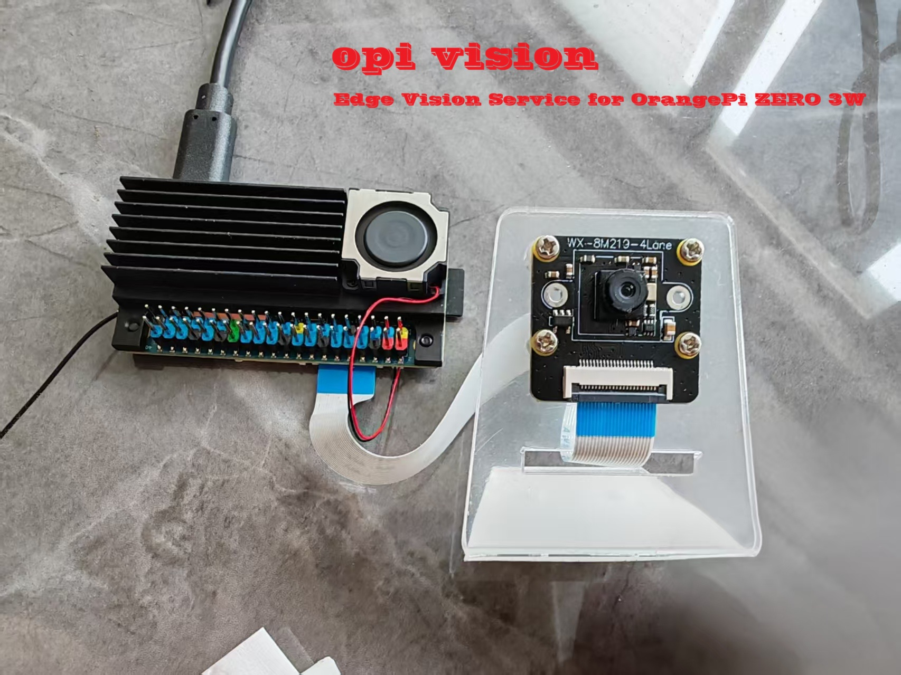

# OrangePi Vision

<p align="center">
  
</p>

<p align="center">
  <strong>面向 OrangePi ZERO 3W 与 IMX219 的边缘视觉服务。</strong><br>
  硬件编码 · 局域网 WebRTC · 加密 SRT · 可选 AI 检测
</p>

<p align="center">
  <a href="https://github.com/ma-shiqi/opi-vision"></a>
  <a href="#访问方式"></a>
  <a href="LICENSE"></a>
</p>

<p align="center">
  <a href="#快速开始">快速开始</a> · <a href="#系统架构">系统架构</a> · <a href="#访问方式">访问方式</a> · <a href="#更新记录">更新记录</a> · <a href="README.md">English</a>
</p>

## 系统架构

```text
IMX219 → NV12 → H.264 + Opus (MPEG-TS)
                 ├─ 本地 MediaMTX → RTSP / WebRTC
                 └─ 加密 SRT → 云端 MediaMTX → WebRTC
```

默认使用 Camera 模式；YOLO 模式可在编码前插入 YOLO26s 与 ByteTrack。运行期音频为 `config/stream.opus`（48 kHz、双声道）；板端 HLS 已关闭。

## 快速开始

```bash
cd ~/orangepi-vision
chmod +x vision vision-withyolo bin/* src/src-camera/build-board-tools.sh
./src/src-camera/build-board-tools.sh  # 仅首次部署需要
./vision --start
```

```bash
./vision --start --size 1280x720 --fps 20
./vision-withyolo --size 1280x720 --fps 20
./vision --status
./vision --log
./vision --stop
```

<p align="center">
  
</p>

<p align="center"><em>通过 WebRTC 播放器查看的实时相机画面。</em></p>

更换模式、分辨率、帧率、编码器或旋转角度前，请先停止服务。

## 访问方式

| 协议 | 地址 | 用途 |
|---|---|---|
| WebRTC | `http://&lt;板卡IP&gt;:8889/vision` | 局域网低延迟预览 |
| RTSP | `rtsp://&lt;板卡IP&gt;:8554/vision` | VLC、NVR、RTSP 客户端 |
| 公网 WebRTC | `https://&lt;你的域名&gt;/vision/` | 云端部署 |

## 配置

```bash
cp config/vision.env.example config/vision.env
```

填写五项 `VISION_SRT_*` 配置后启用云端转发；五项均留空则只使用本地推流。请勿提交 `config/vision.env`。

云端配置模板为 [`config/mediamtx.yml.ToBeUploadToOnlineServer.example`](config/mediamtx.yml.ToBeUploadToOnlineServer.example) 和 [`config/nginx.conf.ToBeUploadToOnlineServer.example`](config/nginx.conf.ToBeUploadToOnlineServer.example)。将它们复制为对应的真实部署文件，替换占位符后再用于服务器；真实配置必须保持私有。

## 更新记录

### V2 — 本地与云端 WebRTC

- H.264 + Opus 一次合流后由本地 MediaMTX 提供局域网流。
- 通过加密 SRT 转发至云端 MediaMTX，供公网 WebRTC 播放。
- Nginx 提供 `/vision/` 播放页并反代 WHEP；默认不启用观看登录。
- FRP 与板端 HLS 作为已关闭的旧回退方案保留。

### V1 — HLS 部署

- 板端 HLS 通过 FRP、Nginx 与 HTTPS 对外提供。
- 该链路已由 V2 WebRTC 替代，仅保留作旧方案参考。

## 文档

- [V2 WebRTC 部署与验收](docs/V2_WebRTC部署与验收.md)
- [SRT 公网部署方案](docs/SRT公网部署方案.md)
- [运行交接记录](docs/HANDOFF.md)
- [FRP + HLS 旧方案](docs/VISION_FRP_NGINX_HTTPS部署指南.md)
- [YOLO26 交叉编译与板端部署](src/src-yolo26/README.md)
- [Cedarc 运行时与硬件编码](src/src-cedarc/vendor/CEDARC_HARDWARE_ENCODING.md)

## 发布安全

请勿提交真实云端配置、`config/vision.env`、证书、私钥、日志或运行状态文件；共享部署配置时仅提交 `.example` 模板。

许可证信息见 [LICENSE](LICENSE)。
